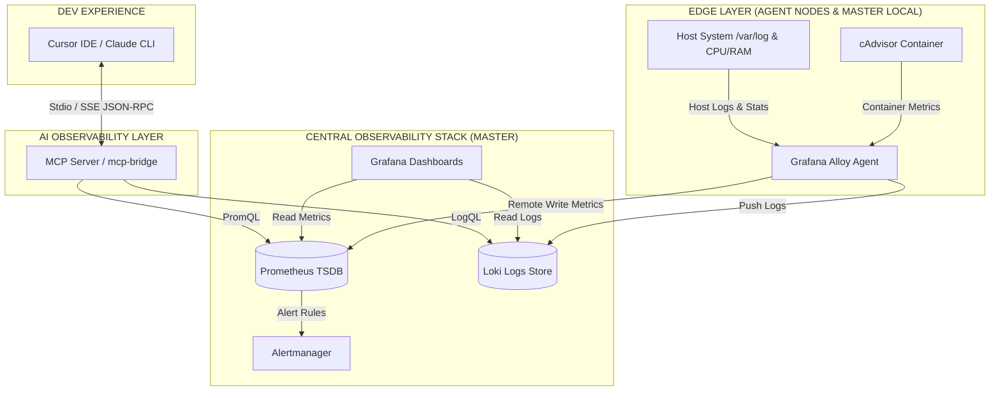

# 📘 Hướng Dẫn Kiến Trúc & Vận Hành Hệ Thống Giám Sát (Grafana Alloy & MCP Server)

Hệ thống giám sát này sử dụng kiến trúc phân tán hiện đại dựa trên **Grafana Alloy** đóng vai trò là Agent thu thập dữ liệu tập trung (Logs, Metrics) và đẩy về **Master Node**. Ngoài ra, hệ thống tích hợp **MCP Server (Model Context Protocol)** để các mô hình ngôn ngữ lớn (LLM) như Cursor IDE, Claude CLI có thể truy vấn trực tiếp và phân tích tài nguyên (RAM, CPU, Disk, Logs).

---

## 🏛️ Sơ Đồ Kiến Trúc & Dòng Chảy Dữ Liệu (Data Flow)



### 1. Luồng dữ liệu Metrics:
* **Thu thập (Collect)**: Grafana Alloy sử dụng module tích hợp sẵn `prometheus.exporter.unix` để lấy metric của Host (CPU, RAM, Disk) và scrape endpoint của `cAdvisor` để lấy thông số của các Docker container.
* **Vận chuyển (Transport)**: Alloy nén và đẩy dữ liệu qua giao thức Prometheus `remote_write` tới cổng `9090` của Master Node.
* **Lưu trữ & Hiển thị**: Prometheus lưu trữ dữ liệu Time-series. Grafana đọc dữ liệu hiển thị lên các biểu đồ thời gian thực.

### 2. Luồng dữ liệu Logs:
* **Thu thập (Collect)**: Alloy đọc trực tiếp từ Docker Socket (`/var/run/docker.sock`) đối với container logs và từ đường dẫn `/var/log/*` đối với syslog của Host.
* **Vận chuyển (Transport)**: Alloy định dạng nhãn (labels) như `container` hoặc `job` rồi đẩy qua API HTTP của Loki (`/loki/api/v1/push`) tại cổng `3100` của Master.

---

## 📂 Cơ Cấu Thư Mục Dự Án

```
grafana-prometeus-loki-alloy/
├── master/                         # Cấu hình tại máy chủ Master (View tập trung)
│   ├── docker-compose.yml          # Chạy Prometheus, Loki, Grafana, Alertmanager, Alloy, cAdvisor, mcp-bridge
│   ├── config.alloy                # Thu thập log/metric nội bộ của chính máy Master
│   ├── prometheus/
│   │   ├── prometheus.yml          # Cấu hình Scrape & kích hoạt Receiver
│   │   └── alert.rules             # Luật cảnh báo (CPU, RAM, Disk, Container Down)
│   ├── loki/
│   │   └── loki-config.yaml        # Cấu hình lưu trữ tệp tin log
│   ├── grafana/
│   │   └── provisioning/           # Tự động nạp Datasource và Dashboard JSON
│   ├── alertmanager/
│   │   └── config.yml              # Cấu hình định tuyến cảnh báo (Slack, Telegram)
│   └── mcp-bridge/                 # MCP Server trung gian kết nối AI với Prometheus/Loki
│
└── agent/                          # Cấu hình cài đặt tại các máy Agent (Client Nodes)
    ├── docker-compose.yml          # Khởi động cAdvisor & Grafana Alloy Agent
    └── config.alloy                # Chỉ định thu thập và đẩy dữ liệu về IP của Master
```

---

## 🚀 Hướng Dẫn Cài Đặt & Chạy Hệ Thống

### Bước 1: Khởi động Master Node (Trung tâm)
Tại máy chủ Master, di chuyển vào thư mục `master` và chạy lệnh docker-compose:
```bash
cd master
docker-compose up -d --build
```
Lệnh này sẽ khởi tạo toàn bộ hạ tầng lưu trữ và hiển thị:
* **Grafana**: `http://localhost:3000` (Tài khoản: `admin` / Mật khẩu mặc định: `changeme`). Các dashboard giám sát Host và Container đã được tích hợp sẵn.
* **Prometheus**: `http://localhost:9090`
* **Loki**: `http://localhost:3100`
* **MCP Bridge (SSE Mode)**: `http://localhost:8000/sse`

---

### Bước 2: Khởi động Agent Node (Máy Client cần giám sát)
Để giám sát một máy chủ khác (Agent), bạn copy thư mục `agent` sang máy đó và thực hiện cấu hình thông qua file `.env`. Việc này giúp bạn dùng chung cấu hình `docker-compose.yml` và `config.alloy` cho mọi Agent mà không cần sửa code bên trong.

1. Tạo file `.env` từ file ví dụ:
   ```bash
   cp .env.example .env
   ```
   *(Trên Windows PowerShell: `copy .env.example .env`)*

2. Mở file `agent/.env` và cập nhật các thông tin sau:
   - **PROMETHEUS_URL**: Thay thế `<master-ip>` bằng IP thực tế của máy chủ Master.
   - **LOKI_URL**: Thay thế `<master-ip>` bằng IP thực tế của máy chủ Master.
   - **AGENT_NAME**: Đặt tên gợi nhớ cho Agent này (ví dụ: `timescaledb-01`, `edge-01`, ...).

   ```env
   PROMETHEUS_URL=http://<YOUR_MASTER_IP>:9090/api/v1/write
   LOKI_URL=http://<YOUR_MASTER_IP>:3100/loki/api/v1/push
   AGENT_NAME=edge-01
   ```

3. Khởi động Agent bằng lệnh:
   ```bash
   cd agent
   docker-compose up -d
   ```

> [!TIP]
> **Nhãn `instance` tự động:**
> Grafana Alloy sẽ tự động sử dụng biến `AGENT_NAME` từ file `.env` làm giá trị nhãn `instance` cho tất cả Metrics và Logs thu thập được từ máy này. Nhờ đó, trên giao diện Grafana hoặc khi truy vấn qua MCP Server, bạn sẽ thấy tên thiết bị thân thiện thay vì địa chỉ IP và Port khó nhớ.

*(Lưu ý: Grafana Alloy trên máy Master cũng tự động thu thập thông số của chính máy Master và được gán nhãn `instance=master-node` mặc định).*

---

## 🤖 Kết Nối MCP Server Vào AI Clients (Cursor / Claude CLI / VS Code)

MCP Server (`mcp-bridge`) hoạt động theo 2 chế độ:
1. **SSE Mode (HTTP)**: Tự động chạy trong container Docker tại port `8000` để các ứng dụng Web/OpenWebUI kết nối qua endpoint `/sse`.
2. **Stdio Mode (Khuyên Dùng)**: Chạy trực tiếp từ dòng lệnh Python trên máy cá nhân để Cursor IDE hoặc Claude CLI giao tiếp trực tiếp qua Stdio.

### Hướng dẫn kết nối Cursor IDE / Claude Desktop (Stdio Mode)

1. Đảm bảo máy chạy AI client đã cài đặt thư viện cần thiết:
   ```bash
   pip install mcp httpx uvicorn fastapi
   ```
2. Thêm cấu hình sau vào phần cài đặt MCP của **Cursor IDE** hoặc file cấu hình **Claude Desktop** (`%APPDATA%/Claude/claude_desktop_config.json` trên Windows):

   ```json
   {
     "mcpServers": {
       "monitoring-mcp": {
         "command": "python",
         "args": [
           "d:/devops/monitoring/grafana-prometeus-loki-alloy/master/mcp-bridge/mcp_server.py"
         ],
         "env": {
           "PROMETHEUS_URL": "http://localhost:9090",
           "LOKI_URL": "http://localhost:3100",
           "MCP_MODE": "stdio"
         }
       }
     }
   }
   ```

3. Sử dụng AI để phân tích sự cố:
   * Bạn có thể hỏi Cursor hoặc Claude CLI các câu hỏi như:
     * *"Kiểm tra tài nguyên RAM, CPU hiện tại của các máy chủ giúp tôi"* (AI sẽ tự động gọi tool `get_system_status`).
     * *"Xem thử container fake-logs có lỗi gì không và kiểm tra tài nguyên của nó"* (AI sẽ gọi tool `explain_root_cause` để gộp log lỗi và CPU/RAM lại phân tích tìm nguyên nhân gốc rễ).
