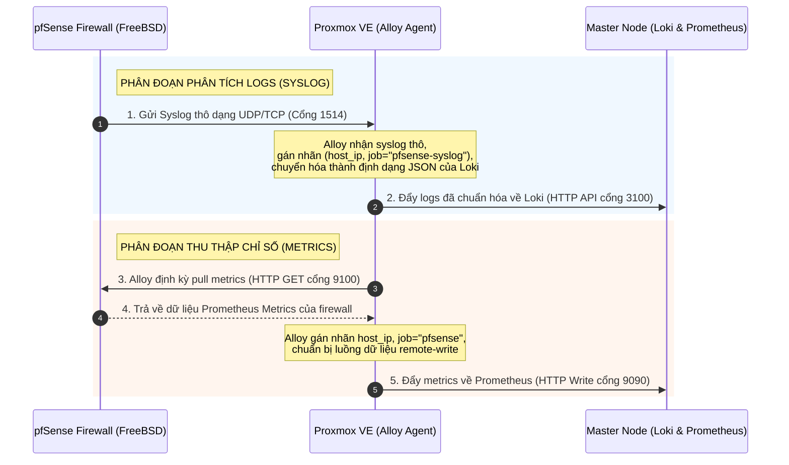

# 🎛️ Hướng Dẫn Giám Sát Proxmox VE & Tường Lửa pfSense (Không dùng Docker)

Thư mục này chứa cấu hình **Grafana Alloy** chạy trực tiếp dưới dạng **systemd service (Native)** trên các hệ điều hành Linux không dùng Docker (như **Proxmox VE** - Debian). 

Alloy này vừa đóng vai trò giám sát chính máy Proxmox, vừa làm **Syslog Collector** thu nhận logs và **Metrics Scraper** lấy dữ liệu từ tường lửa **pfSense** đẩy về Master Node.

---

## 🏛️ Dòng Chảy Dữ Liệu & Giao Thức (Data Flow & Protocols)

### Sơ đồ kiến trúc tổng quan:
```
                       ┌──────────────────────────────────────┐
                       │           pfSense Firewall           │
                       │   - Node Exporter (Metrics: 9100)    │
                       │   - Remote Syslog (Logs: UDP 1514)   │
                       └───────────┬──────────────┬───────────┘
                                   │              │
                    Scrape Metrics │              │ Push Logs (UDP)
                                   ▼              ▼
┌──────────────────────────────────┴──────────────┴───────────────────┐
│                   Proxmox VE Host (Native Agent)                   │
│  - Grafana Alloy Service (Natively installed via systemd)           │
│  - Collects Local Metrics & Journal Logs                            │
└──────────────────────────────────┬──────────────────────────────────┘
                                   │
                   Remote Write    │ Push Logs
                   (Port 9090)     │ (Port 3100)
                                   ▼
┌─────────────────────────────────────────────────────────────────────┐
│                            Master Node                              │
│                [ Prometheus - Loki - Grafana ]                      │
└─────────────────────────────────────────────────────────────────────┘
```

### Sơ đồ dòng chạy chi tiết (Sequence Flow):



> [!NOTE]
> **Giải thích về Remote Syslog Port:**
> Do Loki trên **Master Node** không thể hiểu trực tiếp định dạng Syslog truyền thống từ pfSense, **Grafana Alloy trên Proxmox** sẽ làm trạm trung gian (Collector) mở cổng `1514` để nhận Syslog thô, gán nhãn nhận diện thiết bị, rồi chuyển dịch nó thành định dạng Loki hỗ trợ trước khi đẩy về Master Node. Do đó, trên pfSense ta phải trỏ **Remote Log Servers** về IP của Proxmox kèm cổng `1514`.

---

## 🚀 Hướng Dẫn Cài Đặt trên Proxmox VE (Debian)

Thực hiện các bước sau ngay trên shell của Proxmox VE:

### Bước 1: Chuẩn bị thư mục cấu hình
Copy toàn bộ thư mục `agent-no-docker` này lên máy Proxmox VE (ví dụ đặt tại `/root/agent-no-docker`).

### Bước 2: Tạo và cấu hình file `.env`
Tạo file `.env` trên Proxmox VE:
```bash
cp .env.example .env
```
Mở file `.env` chỉnh sửa thông tin IP tương ứng:
```env
# IP của máy chủ Master chứa Prometheus/Loki
PROMETHEUS_URL=http://<IP_MASTER>:9090/api/v1/write
LOKI_URL=http://<IP_MASTER>:3100/loki/api/v1/push

# Thông tin của máy Proxmox VE này
AGENT_NAME=proxmox-ve
HOST_IP=<IP_PROXMOX>

# IP của tường lửa pfSense
PFSENSE_IP=<IP_PFSENSE>
```

### Bước 3: Chạy Script cài đặt tự động
Cấp quyền thực thi và chạy script:
```bash
chmod +x install.sh
sudo ./install.sh
```

Script này sẽ:
1. Thêm Repo Grafana chính thức và tải về `alloy` thông qua `apt`.
2. Phân quyền cho user `alloy` truy cập `systemd-journal` và socket hệ thống.
3. Đồng bộ hóa biến môi trường từ `.env` vào `/etc/default/alloy`.
4. Đưa cấu hình `config.alloy` vào `/etc/alloy/config.alloy`.
5. Khởi động và kích hoạt tự chạy dịch vụ Alloy.

---

## 🛡️ Hướng Dẫn Cấu Hình trên Tường Lửa pfSense

### 1. Cấu hình đẩy Logs (Remote Syslog)
Mặc định pfSense gửi log theo chuẩn RFC 3164 (Syslog cũ), Alloy đã được thiết lập bộ lắng nghe trên cổng **`1514`** để tương thích.

1. Đăng nhập vào trang quản trị WebUI của pfSense.
2. Truy cập **Status** -> **System Logs** -> chọn tab **Settings**.
3. Cuộn xuống phần **Remote Log Options**:
   * Tích chọn **Send system logs to remote syslog server**.
   * **Source Address**: Chọn interface kết nối với mạng quản lý chứa Proxmox (mặc định là `Any` hoặc `LAN`).
   * **IP Protocol**: `IPv4`.
   * **Remote Log Servers**: Điền IP của Proxmox và cổng `1514` dưới dạng: `<IP_PROXMOX>:1514` (ví dụ: `10.10.10.5:1514`).
   * **Remote Syslog Contents**: Tích chọn những loại log bạn muốn gửi về Loki (khuyên dùng: *System Events*, *Firewall Events*, *Routing Events*, *DHCP Service*).
4. Nhấn **Save**.

### 2. Cấu hình thu thập Metrics (Node Exporter)
Để pfSense xuất ra các chỉ số CPU, RAM, Disk, Traffic mạng về cho Alloy, bạn có thể thực hiện theo 1 trong 2 cách sau:

#### Cách A: Cấu hình qua giao diện WebUI (Khuyên dùng)
1. Trên pfSense WebUI, truy cập **System** -> **Package Manager** -> **Available Packages**.
2. Tìm kiếm gói `prometheus-node-exporter` và nhấn **Install**.
3. Sau khi cài đặt hoàn tất, truy cập **Services** -> **Prometheus Node Exporter**:
   * Tích chọn **Enable Prometheus Node Exporter**.
   * **Listen Address**: Chọn `LAN` hoặc interface hướng về phía Proxmox (không mở ra WAN).
   * **Listen Port**: Giữ mặc định `9100`.
4. Nhấn **Save**.

#### Cách B: Cấu hình qua Command Line (SSH / Console)
Do pfSense sử dụng nhân **FreeBSD** và trình quản lý gói **`pkg`** thay vì apt của Linux, bạn có thể cài đặt bằng lệnh trực tiếp:
1. Kết nối SSH tới pfSense (hoặc chọn mục `8) Shell` từ menu console trực tiếp).
2. Chạy lệnh cài đặt gói Node Exporter tích hợp của pfSense:
   ```bash
   pkg install -y pfSense-pkg-prometheus-node-exporter
   ```
3. Kích hoạt và khởi chạy service:
   ```bash
   # Kích hoạt service tự khởi động cùng hệ thống
   sysrc prometheus_node_exporter_enable="YES"
   
   # Khởi chạy service ngay lập tức
   service prometheus_node_exporter start
   ```
   *(Sau khi chạy, Node Exporter sẽ lắng nghe tại cổng `9100` của pfSense để Alloy có thể crawl dữ liệu)*.

---

## 🔍 Kiểm tra hoạt động trên Grafana (Master)

Sau khi hoàn tất cấu hình, truy cập vào Grafana của bạn:

### 1. Kiểm tra log từ pfSense
Vào mục **Explore** của Grafana, chọn datasource **Loki** và nhập truy vấn LogQL:
```logql
{job="pfsense-syslog"}
```
Bạn sẽ thấy toàn bộ log tường lửa, traffic block/allow, log DHCP... đổ về theo thời gian thực.

### 2. Kiểm tra log từ Proxmox VE
Truy vấn log hệ thống Proxmox VE:
```logql
{job="systemd", instance="proxmox-ve"}
```

### 3. Kiểm tra Metrics
* **Chỉ số Proxmox VE**: Gõ `node_cpu_seconds_total{instance="proxmox-ve"}` trong Prometheus/Grafana.
* **Chỉ số pfSense**: Gõ `node_cpu_seconds_total{instance="pfsense"}`.
